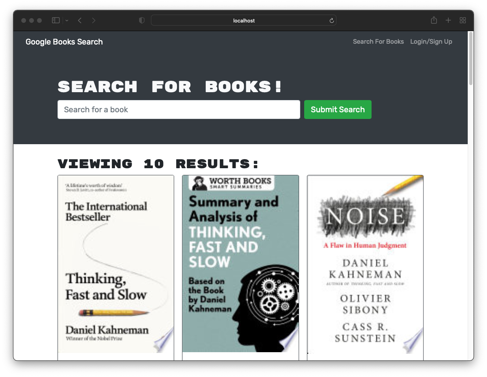

# Book-Search_Engine

[](https://opensource.org/licenses/MIT)

## Description

This is a Google Books API search engine buit with a RESTful API, and refactor it to be a GraphQL API built with Apollo Server. The app was built using the MERN stack, with a React, MongoDB, and Node.js/Express.js and API.

## Table of Contents

- [Description](#description)
- [Installation](#installation)
- [Usage](#usage)
- [Screenshot](#screenshot)
- [Deployed Link](#deployed-link)
- [Contact](#contact)

## Installation

```md
Run (npm install)
```

## Usage

```md
Run (npm run start & npm run develop)
```

# Screenshot



## Contact

Email: vancungthawng@outlook.com

Github: [Click Here!](https://github.com/vanjungthawng)
